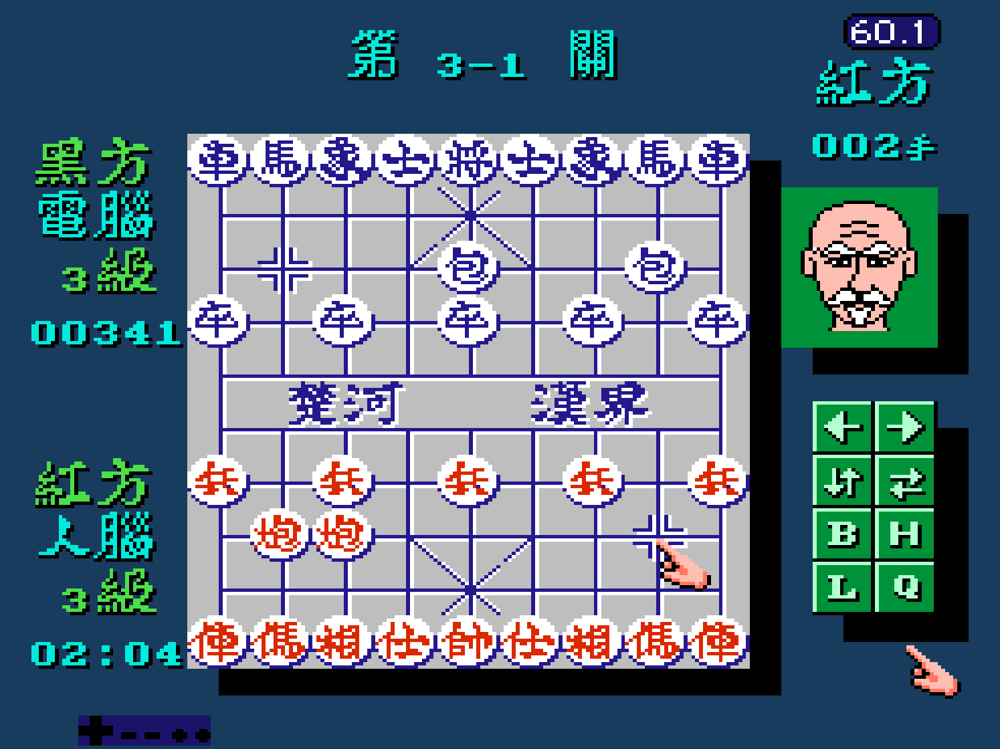

# TXC 中國象棋引擎 — Famicom 6502 還原為 C11

**txc-chess-engine** 是從 TXC 紅白機（Famicom／NES）中國象棋 ROM 還原的獨立 C11 搜尋引擎，提供合法走法、局面評估、迭代加深與 Alpha-Beta 搜尋。原始碼標示對應 ROM 位址，並以 py65 執行原始 6502 子程序進行差分驗證。

English: A standalone Xiangqi (Chinese chess) engine reconstructed from a TXC Famicom 6502 ROM into readable C11. Includes a command-line player, C API and differential validation tools. The compiled engine runs without a ROM or emulator; ROM-based verification requires the matching cartridge image.



畫面取自原作，僅作背景參考；本專案提供象棋計算核心與命令列介面，未移植遊戲圖形、音樂或選單。

[快速開始](#快速開始) · [C API 與命令列](docs/technical-guide.md) · [差分驗證](analysis/engine_map.md) · [對局基準](comparison/README.md) · [還原背景與署名](docs/background.md)

## 快速開始

Windows 使用 GCC 與 PowerShell，從原始碼建置：

```powershell
git clone https://github.com/eric-wen-dev-it/txc-chess-engine.git
cd txc-chess-engine
.\build.ps1
.\build\txc.exe --depth 4
.\build\txc.exe --depth 3 --play
```

其他具備 C11 編譯器的平台可使用：

```sh
cc -std=c11 -O2 -Isrc src/main.c src/txc_position.c src/txc_search.c -o txc
./txc --depth 4
```

`--play` 支援輸入 `h2e2` 等著法，以及 `hint`、`quit`。座標 `a0` 是紅方視角左下角，`i9` 是右上角。深度接受 1～4；選擇性延伸可到內部第 12 層。另支援 `--fen` 與 `--moves`，詳見 [完整用法及嵌入範例](docs/technical-guide.md)。

## 搜尋與驗證

核心保留原版棋子身份、走法順序、棋子位置表、增量評估、主變化優先、殺手著法與選擇性延伸。它是依機器碼重建的程式，並非原作者原始碼。

| 已保存的驗證紀錄 | 範圍 |
|---|---|
| 走法與局面 | 100 個局面、257,400 次偽合法判斷、100 份有序著法列表 |
| 搜尋 | 210 組最優著、評分與節點數對照 |
| 邊界 | 11 組特殊行為測試 |
| 初始局面 depth 4 | 18,644 個搜尋節點的追蹤相符 |

詳見 [驗證摘要](analysis/validation_summary.json) 與 [ROM 還原記錄](analysis/engine_map.md)。這些是指定樣本的歷史測試，不能證明所有合法局面完全等價；報告中的 README 雜湊屬於報告建立時的文件版本。從 FEN 建立局面可能缺少原版同類棋子身份及走棋歷史，詳見技術指南。

## 效能與對局紀錄

[14 局基準對局](comparison/README.md) 比較的是**現代電腦上的 TXC C 版**與 ChineseChessAI 的單執行緒傳統引擎，雙方不用棋譜。在該組 100 ms 預算的 8 局中，TXC 勝 8 局；1,000 ms、靜搜 12 層的 2 局則各勝一局。這些小樣本結果不能推算可靠 Elo，也不是 NES 原機與現代硬體的速度比較。

## 文件、署名與授權

- [文件索引](docs/README.md)：API、ROM 驗證、對局方法與背景文章。
- 原卡帶作者尚未確認；GPT6 完成 C11 還原與差分驗證，Claude（Opus 4.8）參與對局比較及分析，沿用原專案署名。
- 儲存庫授權文字見 [MIT License](LICENSE)；原遊戲及素材權利不因本文件改變。
- [ChineseChessAI](https://github.com/eric-wen-dev-it/ChineseChessAI) 提供現代象棋搜尋與訓練；[Advanced Daisenryaku PC](https://github.com/eric-wen-dev-it/AdvancedDaisenryaku) 展示另一個 ROM 邏輯原生移植專案。

問題與可重現局面請提交至 [GitHub Issues](https://github.com/eric-wen-dev-it/txc-chess-engine/issues)。
